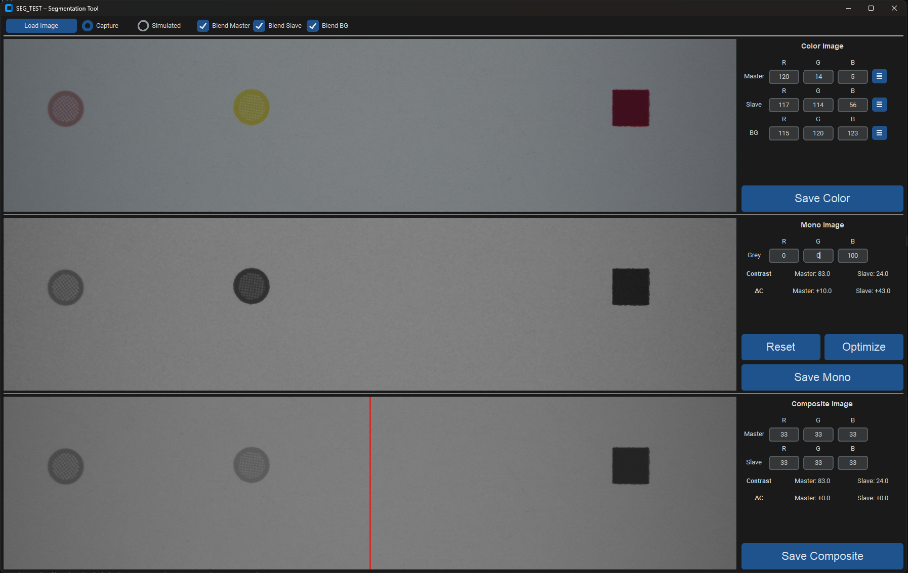

<div align="center">

# SEG_TEST

**Image Segmentation & Greyscale Contrast Analysis**

[Overview](#overview) · [Getting Started](#getting-started) · [GUI Layout](#gui-layout) · [Modes](#modes) · [Algorithms](#algorithms) · [Building](#building-standalone-executable)

</div>

A dark-themed [CustomTkinter](https://github.com/TomSchimansky/CustomTkinter) desktop application for segmenting images into regions, exploring weighted RGB-to-greyscale conversions, and measuring how channel weight changes affect contrast.

## Overview

SEG_TEST segments an image into three regions — **Master** (rectangle), **Slave** (circle), and **Background** — using HSV saturation-based contour detection. Three side-by-side panels let you:

1. **Color** — Adjust or replace each region's colour, with a color picker per row
2. **Mono** — Tune R/G/B greyscale weights and see contrast + ΔC from baseline
3. **Composite** — Compare two independent weight sets (one per segment half), split by a red centre divider

## Features

- **Dual mode** — Load real `.bmp`/`.jpeg` captures or generate a synthetic 2112×500 test pattern
- **HSV segmentation** — Saturation thresholding detects coloured shapes on grey backgrounds
- **ROI fallback** — Draw bounding rectangles when auto-detection fails
- **Color picker** — [CTkColorPicker](https://github.com/Akascape/CTkColorPicker) popup (☰ button) per region
- **Color presets** — Dropdown per row with named colours: Cyan, Magenta, Yellow, Black, Orange, Green, Violet
- **Numeric inputs** — Direct R/G/B entry fields (no sliders), with clamping and live update
- **Normalize toggle** — Toolbar checkbox switches between ratio mode (weights sum to 1) and gain mode (weights scale 0–1, clipped to 0–255)
- **Grey value** — Median grey level displayed per region in both Mono and Composite sections
- **Baseline + ΔC** — Contrast measured at default weights (33/36/51); delta shown live as weights change
- **Reset** — One-click return to default weights (33/36/51)
- **Optimize** — Coarse-to-fine grid search for the weight set that maximises min(C_master, C_slave)
- **Dynamic half-detection** — Composite labels auto-map Master/Slave to the correct image half
- **Per-section save** — Individual Save buttons for Color, Mono, and Composite outputs
- **Blend mode** — 50/50 blend or flat replace per region (Capture mode)

## Getting Started

### Prerequisites

- Python 3.8+
- Tkinter (included with standard Python — used for `tk.Canvas` and file dialogs)

### Installation

```bash
pip install customtkinter CTkColorPicker opencv-python numpy Pillow
```

### Run

```bash
py SEG_TEST.py
```

The app launches in **Simulated** mode with a default test pattern (cyan circle, yellow rectangle, light grey background).

## GUI Layout



## Modes

### Capture

1. Click **Load Image** to open a `.bmp`, `.jpeg`, or `.png` file.
2. HSV saturation-based segmentation runs automatically.
3. If detection fails, you are prompted to draw ROI bounding rectangles.
4. Numeric inputs auto-populate with detected median RGB per region.
5. Toggle **Blend** checkboxes for 50/50 blend instead of flat colour replace.

### Simulated

- Generates a **2112×500** synthetic image with configurable shapes.
- Defaults: cyan circle (Slave), yellow rectangle (Master), light grey background `(240, 240, 240)`.

### Colour Presets

| Name | R | G | B | Hex |
|---|---|---|---|---|
| Cyan | 0 | 174 | 239 | `#00AEEF` |
| Magenta | 236 | 0 | 140 | `#EC008C` |
| Yellow | 255 | 242 | 0 | `#FFF200` |
| Black | 35 | 31 | 32 | `#231F20` |
| Orange | 254 | 80 | 0 | `#FE5000` |
| Green | 0 | 171 | 132 | `#00AB84` |
| Violet | 68 | 0 | 153 | `#440099` |

Select a preset from the dropdown next to each colour row (Master, Slave, BG) to instantly fill the R/G/B values. The ☰ colour picker remains available for arbitrary colours.
- Input changes regenerate the image immediately — no segmentation step needed.

## Algorithms

### Segmentation

1. Convert to HSV, threshold saturation (S > 50) to isolate coloured shapes
2. Morphological open + close (5×5 elliptical kernel) to clean noise
3. `findContours` with `RETR_EXTERNAL`
4. Classify: **Rectangle** = `approxPolyDP` → 4 vertices + circularity < 0.75; **Circle** = circularity > 0.6
5. Outermost circle (largest bounding radius) = Slave
6. Background = inverse of Master ∪ Slave masks

### Greyscale Conversion

**Normalized** (default, checkbox checked):

$$\text{grey} = \frac{R \cdot w_R + G \cdot w_G + B \cdot w_B}{w_R + w_G + w_B}$$

**Unnormalized** (checkbox unchecked):

$$\text{grey} = \text{clip}\!\left(R \cdot \frac{w_R}{100} + G \cdot \frac{w_G}{100} + B \cdot \frac{w_B}{100},\ 0,\ 255\right)$$

Weights $w_R, w_G, w_B$ range 0–100, default 33/36/51 (slight blue emphasis).

### Contrast

$$C = |\text{median}(\text{region}) - \text{median}(\text{background})|$$

**Baseline** is computed once at equal weights. **ΔC** = current contrast − baseline, shown with `+`/`−` prefix.

> [!NOTE]
> Alternative formulas preserved for future use:
> - **Michelson**: $(I_{max} - I_{min}) / (I_{max} + I_{min})$
> - **Weber**: $(I_{target} - I_{bg}) / I_{bg}$

### Composite

The image is split at the midpoint with a red vertical divider. Each half applies its own R/G/B weight set. The app auto-detects which segment is in which half, so the Master/Slave labels always map correctly.

### Optimize

Scoring function (maximin):

$$\text{score}(w_R, w_G, w_B) = \min(C_{master}, C_{slave})$$

This ensures neither region is sacrificed for the other.

**Coarse-to-fine grid search:**

1. **Coarse** — sweep all $(w_R, w_G, w_B)$ in steps of 5 over 0–100 (21³ = 9,261 combinations)
2. **Fine** — refine ±5 around the best coarse result in steps of 1 (≤ 11³ = 1,331 combinations)
3. Apply the best weights and update the display

Per-region R/G/B pixel arrays are pre-extracted so each score evaluation only computes medians — no full image rebuilds. Progress bar shows 0–70% during coarse, 70–100% during fine.

## Input Reference

| Section | Inputs | Range | Default | Purpose |
|---|---|---|---|---|
| Color | 9 numeric (R/G/B × Master/Slave/BG) + 3 color pickers | 0–255 | Detected or simulated | Region colour |
| Mono | 3 numeric (R/G/B weight) | 0–100 | 33/36/51 | Channel contribution to greyscale |
| Composite | 2×3 numeric (R/G/B weight × Master/Slave) | 0–100 | 33/36/51 | Per-half greyscale weights |
| Toolbar | Normalize checkbox | on/off | on | Ratio vs gain mode |

## File I/O

| Direction | Formats | Details |
|---|---|---|
| **Input** | `.bmp`, `.jpeg`, `.png` | Via Load Image dialog |
| **Save Color** | `.bmp` (default) | Colour image after region adjustments |
| **Save Mono** | `.bmp` (default) | Greyscale conversion |
| **Save Composite** | `.bmp` (default) | Composite image (without red divider) |

## Difficult Combinations

Some colour combinations make it impossible for a **single** set of greyscale weights to produce good contrast for both regions simultaneously. In these cases the Mono section's **Optimize** may improve one region at the expense of the other, because no weight triple can separate both from the background at once.

The **Composite** section solves this by applying **independent weights per half** — each region gets the weight set that maximises its own contrast, without compromising the other.

### Test Scenarios

| # | Master | Slave | BG | Why it's hard |
|---|--------|-------|----|---------------|
| 1 | `(237, 218, 255)` | `(255, 255, 0)` | `(240, 240, 240)` | Master is near-white lavender — almost indistinguishable from the light background in any single channel mix |
| 2 | `(126, 137, 175)` | `(237, 234, 176)` | `(235, 240, 243)` | Both regions are low-saturation pastels close to the background; boosting one channel to separate Master pushes Slave closer to BG |
| 3 | `(0, 255, 255)` | `(241, 209, 255)` | `(240, 240, 240)` | Slave is near-white violet — very high luminance, almost identical to BG regardless of weight choice |

To reproduce: set the Master/Slave/BG values in **Simulated** mode, click **Optimize** in both Mono and Composite, and compare the ΔC values. The Composite section will show positive ΔC for both regions where Mono cannot.

## Building Standalone Executable

```bash
pip install pyinstaller
pyinstaller --onefile --windowed --name SEG_TEST \
  --hidden-import customtkinter \
  --hidden-import CTkColorPicker \
  SEG_TEST.py
```

> [!TIP]
> Output lands in `dist/SEG_TEST.exe` (~200–400 MB). The `.exe` runs standalone without Python installed.

## Project Structure

```
PYTHON/
├── SEG_TEST.py        # Main GUI application
├── SEGMENTATION.py    # Original channel isolation experiments
├── README.md
└── PRE_TEST/          # Test images (.bmp, .png)
```
